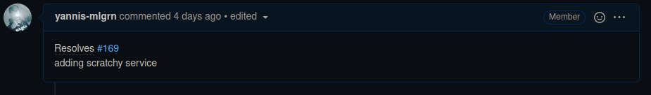
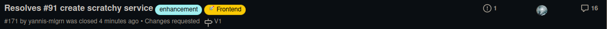
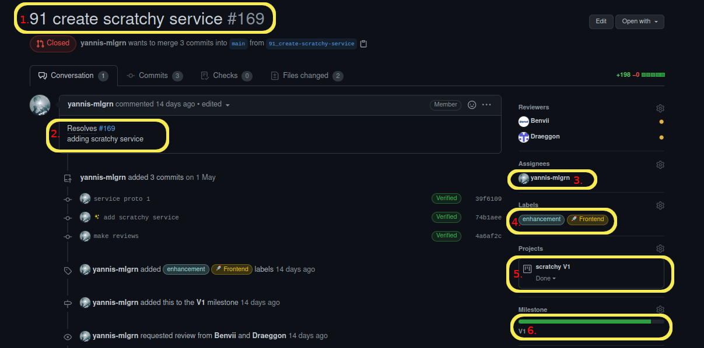

# How to contribute to this project ?

## **Choose a issue :**

You must choose an issue on [the project github](https://github.com/mdl29/scratchy). If you want to do something but no issue is created yet you must create one (try to tag it properly).

## **Fork the project :**

You need to fork [scratchy repository](https://github.com/mdl29/scratchy)

 * ℹ️ [how to fork a github project ?](https://guides.github.com/activities/forking/)

## **Create your branch :**

 Create a new branch with the following name :
 `ISSUEID_TITLE-OF-ISSUE`
  * **example :** `91_create-scratchy-service`
  
## **create a pull request :**  

When you think your code is ready to be merged to the project create a pull request.

Create a new pull request with the following name :

when your pull request link to an issue :

* **example :**` Resolves #ISSUEID : title of issue`.

 If you want to make a pull request to add new features but you don't have an issue 

 * **example :**`[TAG]title of new features`.
    > Tag are : Backend / Frontend / Tools / Doc / Bug / ... all labels in scratchy repository
  

 Then please write a pull request description like this :
  

   add in description the id of the issue resolved and a message who say what you add or do in your pull request. Add label (Frontend,Backend,documentation...), add to project your pull request(V1,V2) and milestone depending your issue.
    
* **Real Example :**   
   * if you want to solve #91 issue you should have named your pull request : `resolves #91 : Create a scratchy service` 
  

  * in description you must to link issue with `#91` and write a description of new features. Then add labels , project and milestone
    
  
After, wait a reviewer who approve your code. If the reviewer request change make them and request review again. To finish if the revewier approve your code you can squash and merge your pull request to main branch 

## **What are the requirement for proposing a pull request ?**

- ### **There are the convention to respect for each programing language**

    | Language | Convention                                            |
    | -------- | ----------------------------------------------------- |
    | Python   | [PEP8](https://pep8.org/)                             |
    | YAML     | [the linter](https://github.com/adrienverge/yamllint) |

- ### **Other important notes**

    Please comment your code in a clear way (we don't ask for a novel but someone who read your code must be able to tell what it does)
