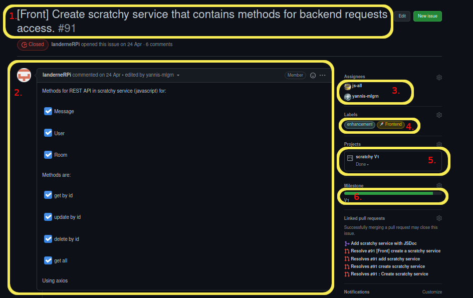
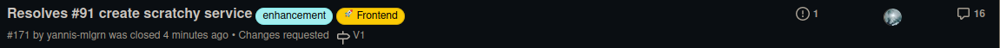

# How to contribute to this project ?

## summary :

- [How to contribute to this project ?](#how-to-contribute-to-this-project-)
  - [summary :](#summary-)
  - [**Choose an issue :**](#choose-an-issue-)
  - [**Fork the project :**](#fork-the-project-)
  - [**Create your branch :**](#create-your-branch-)
  - [**Create an issue :**](#create-an-issue-)
  - [**Create a pull request :**](#create-a-pull-request-)
  - [**What are the requirement for proposing a pull request ?**](#what-are-the-requirement-for-proposing-a-pull-request-)

     * [Language programming convention](#There-are-the-convention-to-respect-for-each-programing-language) 
     * [Other important notes](#Other-important-notes)

## **Choose an issue :**

You must choose an [issue](https://github.com/mdl29/scratchy/issues) on [the project github](https://github.com/mdl29/scratchy). If you want to do something but no issue is created yet you must create one (try to tag it properly).

## **Fork the project :**

You need to fork [scratchy repository](https://github.com/mdl29/scratchy)

 * >ℹ️ [how to fork a github project ?](https://guides.github.com/activities/forking/)

## **Create your branch :**

 Create a new branch with the following name :
 `ISSUEID-title_of_issue`
  * **example :** `91-create_scratchy_service`

## **Create an issue :**

> ℹ️[Github issue guide](https://guides.github.com/features/issues/)

1. Choose a implicite title (max ~ 13 words),
    your title must be begin by a tag.
    > tags have same name of labels (Front,Back,Doc,Bug,Help...)   

2. Write a good description with much details as possible 

3. Assign your issue to yourself if you want to solve it or wait for someone to assign it

4. Add labels, for example in scratchy service issue (picture) we use frontend and enchancement labels.
**see all labels [here](https://github.com/mdl29/scratchy/labels) and their meaning**

5. Add your issue to a project the current one ([V1](https://github.com/mdl29/scratchy/projects/1)) if it is important or the next one if not
because in the future we will go over [V2](https://github.com/mdl29/scratchy/projects/2)
 
6. Add your issue to the current one milestone if it is important or the next one.

* **Example :** `[example] Create scratchy service that contains methods for backend requests access`
    
  

## **Create a pull request :**  

When you think your code is ready to be merged to the project create a pull request.

1. Choose the title:
    patern: `ISSUEID title of the issue `
    (if you have respected the naming branch pattern the title will be good automatically)

    If you want to make a pull request to add new features but you don't have an issue, you must be create an issue and in them explain what you want add,resolves...  Finally after you have resolved her you can push your pull request respecting issue and pull request template. 
 
2. Make a great description :
    
    Please write a pull request description like with :
        - the id of the issue resolved with a keyword to link to the coresponding issues
          > ℹ️ [how to link a issue and use the keywords](https://docs.github.com/en/issues/tracking-your-work-with-issues/creating-issues/linking-a-pull-request-to-an-issue#linking-a-pull-request-to-an-issue-using-a-keyword)(Fixes,resolves...)
        - a message who say what you add or do in your pull request.

3. Assign it to yourself

4. Add labels, for example in scratchy service issue (picture) we use frontend and enchancement labels.
**see all labels [here](https://github.com/mdl29/scratchy/labels) and their meaning**

5. Add your issue to a project the current one ([V1](https://github.com/mdl29/scratchy/projects/1)) if it is important or the next one if not
because in the future we will go over [V2](https://github.com/mdl29/scratchy/projects/2)

6. Add your issue to the current one milestone if it is important or the next one.

* **Example :** `[example] Create scratchy service that contains methods for backend requests access`
    

7. If it's work in progress, set the [pull request status to draft](https://github.blog/2019-02-14-introducing-draft-pull-requests/)
After, set your pull request status to open, wait for a reviewer who approve your code. If the reviewer request change make them and request review again. To finish if the revewier approve your code, the code owner will squash and merge
your commits in pull request to main branch 

## **What are the requirement for proposing a pull request ?**

- ### **There are the convention to respect for each programing language**

    | Language | Convention                                            |
    | -------- | ----------------------------------------------------- |
    | Python   | [PEP8](https://pep8.org/)                             |
    | YAML     | [The linter](https://github.com/adrienverge/yamllint) |

- ### **Other important notes**

   * **comments :**
    Please comment your code in a clear way (we don't ask for a novel but someone who read your code must be able to tell what it does)
