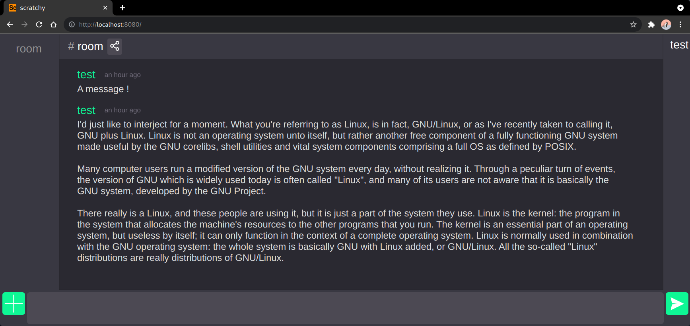

# Frontend documentation

  - [📂 **front directory**](../../front/)

## Setup

install dependencies

```bash
npm ci
```

## Build

build the frontend

```bash
npm run build
```

this will build in `front/dist`, you then need to start a server there

> ex. with python

```bash
cd dist
python -m http.server
```

scratchy should then be on [http://localhost:8000/index.html](http://localhost:8000/index.html)

## Development server

to run the development server

```bash
npm run serve
```

### Lint

if you plan on contributing, we'll ask you to lint your code, this should already happen on the development server, but to run only the linter :

```bash
npm run lint
```

## Preview



## vuejs components :

- [activity-bar](../../front/src/components/ActivityBar.vue)

  > display the current room's name and allows room sharing

- [login](../../front/src/components/Login.vue)

  > login popup

- [message-list](../../front/src/components/MessageList.vue)

  > display all the messages of a room (or any array of messages really). this takes up most of the document's area.

- [room-list](../../front/src/components/RoomList.vue)

  > display all joined room

- [room-editor](../../front/src/components/RoomEditor.vue)

  > popup used to create / join rooms

- [message-editor](../../front/src/components/MessageEditor.vue)

  > message input field

- [user-list](../../front/src/components/UserList.vue)

   > display the current room's users (broken right now because of never expiring caching)

